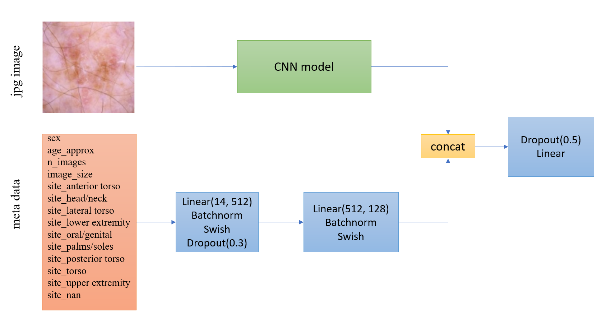
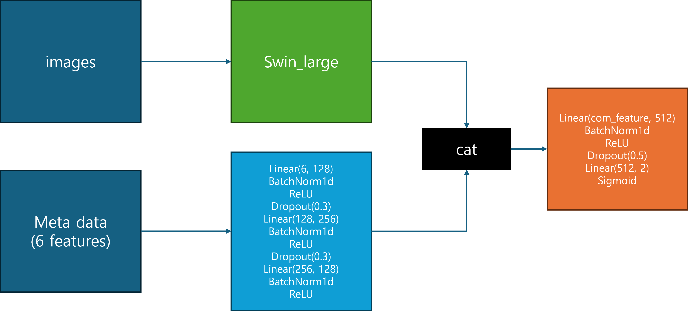

# Reference Model feature

## SIIM-ISIC-Melanoma-Classification-1st-Place-Solution
- cnn: EfficientNet, ResNet, SE-ResNeXt
- Loss Function: CrossEntropyLoss

</img>

[git:SIIM-ISIC-Melanoma-Classification-1st-Place-Solution](https://github.com/haqishen/SIIM-ISIC-Melanoma-Classification-1st-Place-Solution.git)

## ISIC-2024 Pytorch Inference (Swin + ViT)
- transformer: Swin Transformer
- Loss Function: BCELoss

</img>

[kaggle:ISIC-2024 Pytorch Inference (Swin + ViT)](https://www.kaggle.com/code/qiaoyingzhang/isic-2024-pytorch-inference-swin-vit)